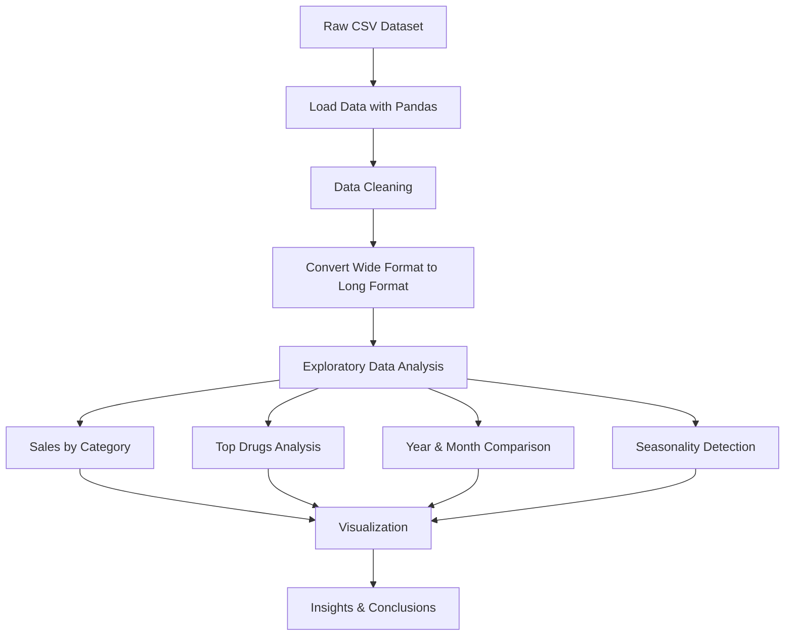

# Pharmaceutical Sales Data Analysis

A data analytics project exploring pharmaceutical drug sales trends using **Python, Pandas, and Matplotlib** inside Jupyter Notebook.

This project analyzes daily pharmaceutical sales data to identify high-performing drug categories, seasonal trends, and sales patterns across multiple years.

---

## Project Overview

The dataset contains daily sales quantities for multiple drug categories (ATC codes).  
The goal is to transform raw data into meaningful business insights through data cleaning, aggregation, and visualization.

Key objectives:

- Analyze total sales per drug category
- Identify top performing drugs
- Compare sales across specific months and years
- Detect seasonal patterns in respiratory drugs
- Compute average daily sales performance

---

## Tech Stack

- Python
- Pandas
- Matplotlib
- Jupyter Notebook
- Git & GitHub

---

## Project Structure

```md
Analysing-pharmaceutical-sales-data/
│
├── data.csv
│
├── analysis.ipynb
│
└── README.md
```

---

## Data Processing Workflow

The dataset was originally in **wide format** where each drug category existed as a column.

It was converted into **long format** using Pandas `melt()` for easier analysis.

---

## Analysis Performed

1. Total sales by ATC drug category
2. Highest selling drug categories
3. Top drugs for selected months
4. Most sold drug in 2017
5. Average daily sales comparison
6. Seasonal trend analysis of respiratory drugs (R03)

---

## Example Insight

Respiratory drugs (R03) show noticeable variation across months, suggesting seasonal demand patterns related to respiratory illnesses.

---

## How to Run

1. Clone repository
2. Install dependencies
3. Start notebook

4. Open `analysis.ipynb`

---

## Learning Outcomes

- Data reshaping (Wide → Long format)
- Exploratory Data Analysis (EDA)
- Time-based analysis
- Data visualization
- Analytical storytelling

---

## Analysis Workflow



```md


```

---

## Author

Anchal Singh
Software Engineer

### Thank You
